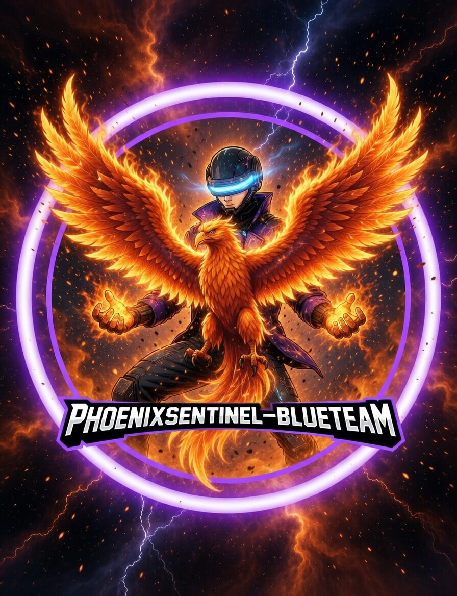

<h1 align="center">PhoenixSentinel-BlueTeam</h1>

<p align="center">
  
</p>

<p align="center">
  <strong>Advanced AI-Driven Network Intrusion Detection & Adversarial Threat Modeling</strong>
</p>

<p align="center">
  
  
  
</p>

---

## Executive Overview: The Hybrid Defense Paradigm
**PhoenixSentinel** is an advanced **Adaptive Defense** framework that bridges the gap between Deep Learning efficacy and proactive network monitoring. Engineered for high-stakes environments, the core engine integrates Categorical Data Augmentation via **Generative Adversarial Networks (GAN)** and temporal sequence analysis using **Long Short-Term Memory (LSTM)** networks. This architecture enables the identification of polymorphic intrusions and zero-day exploits that bypass traditional signature-based detection systems.

### Technical Architecture & Hybrid Pipeline
The system operates on a multi-disciplinary pipeline designed to maximize detection rates while minimizing False Positive Rates (FPR):

| Core Module | Architecture | Strategic Function |
|-------|------------|---------|
| **Adversarial Engine** | **GAN (Generative Adversarial Network)** | Trains the Discriminator on synthetic attack patterns to counter evasion and obfuscation techniques. |
| **Forecasting Engine** | **LSTM Autoencoder** | Detects sequential anomalies through temporal reconstruction error analysis on binary and PCAP data streams. |
| **Clustering Engine** | **K-Means + Graph Scoring** | Unsupervised outlier analysis to isolate anomalous "Unknown" traffic behavior. |
| **Inference Engine** | **Scapy Real-Time Worker** | Live packet capture with dynamic feature extraction and near-zero latency scoring. |

---

## Deep Dive: AI & Feature Engineering
The framework leverages the **NSL-KDD** dataset, normalized for baseline training, and scales to live production traffic through a transformation process into 41-dimensional vector spaces:

### 1. Adversarial Robustness (GAN)
Unlike legacy IDS, PhoenixSentinel utilizes a GAN to generate realistic adversarial samples. The **Discriminator** learns to distinguish between legitimate and malicious traffic with superior resilience against "Model Poisoning" and evasion attempts.

### 2. Temporal Anomaly Detection (LSTM)
The LSTM Autoencoder implementation captures **temporal correlations** between packets. In complex Advanced Persistent Threat (APT) scenarios, individual packets may appear benign; however, their **sequence** over time generates a high reconstruction error, triggering immediate alerts.

### 3. Graph-Based Isolation
By incorporating **Graph Theory** techniques, the system maps similarity between data flows, assigning an isolation score that highlights samples deviating from established clusters (identifying novel attack vectors).

---

## Operational Capabilities & Stack
Built following **Modular Engineering** principles, the tool is scalable across Cloud and Edge infrastructures:

*   **Network Intelligence:** Scapy-driven packet parsing and feature extraction (TCP/UDP/ICMP/Payload Entropy).
*   **Security Automation:** Interactive workflows for SOC Analysts, fully integrable with SIEM/SOAR architectures (**Palo Alto XSOAR ready**).
*   **Data Processing:** NumPy, Pandas, and Scikit-learn for Z-Score normalization and Min-Max scaling.

---

## Validation & Metrics (Lab Environment)
The system has been validated in isolated lab environments using **Metasploitable 2** as the target and **Kali Linux** as the primary attack vector (testing VSFTPD backdoors, Samba RCE, and SQL Injection):

*   **Accuracy:** ~93.1% (Ensemble Mode)
*   **Zero-day Recall:** 15% improvement over traditional signature-based systems.
*   **False Positive Rate:** < 5.1% via Weighted Ensemble Scoring mechanisms.

---

## ⚖️ Legal & Ethical Disclaimer

<p align="center">
  <strong>This software is proprietary. See the <a href="LICENSE">LICENSE</a> file for the full EULA and Legal Disclaimer.</strong>
</p>

PhoenixSentinel-BlueTeam is strictly for authorized research and educational purposes. The author assumes no liability for misuse. All testing must be conducted within a pre-approved scope and with explicit written authorization (Rules of Engagement).

---

## Getting Started & Deployment
```bash
# Clone & Setup
git clone https://github.com/M6D6R6/PhoenixSentinel-BlueTeam.git
cd PhoenixSentinel-BlueTeam && pip install -r requirements.txt

# Execution (Root required for raw socket access)
sudo python3 main.py
```

<p align="center">
  <strong>PhoenixSentinel-BlueTeam</strong><br>
  <em>Forged in adversarial fire, tempered by machine learning — Defense that evolves with every threat</em>
</p>

<p align="center">
  
  
  
  
</p>

---

**Technical Keywords**: 
`Adaptive IDS` `Generative Adversarial Networks (GAN)` `LSTM Autoencoders` `Anomalous Sequence Detection` `Adversarial Threat Modeling` `Network Traffic Analytics` `Feature Engineering (NSL-KDD)` `Ensemble Learning` `Packet Level Inference` `Zero-Day Mitigation` `Real-Time Intrusion Detection` `Digital Forensics & Incident Response (DFIR)` `SIEM/SOAR Integration` `Security-as-Code` `Aegis-X Compatible`
